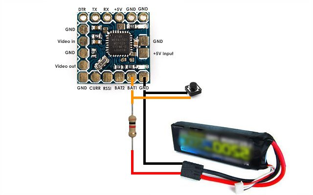

GSOSD STAND ALONE
=================
To be honest, operating the OSD via the serial connection can be a bit complicated and in cases where you only need to show the battery volage or runtime, it is just overkill. Therefore a stand alone version has been made to serve these simple cases. The key feature is that all settings can be changed on the field in a couple of seconds.

Hardware
--------
Operating the OSD is done using a single push button that can be attached between any of the sensor inputs (VBAT1, VBAT2, RSSI or CURR) and ground, provided that you use a pullup resistor to set the input high by default. You can still use all of these inputs to measure voltages though. But when doing so, you should not short the voltage source if that creates a problem (smoke!). So use a resistor in series with your voltage source if needed. A 1k resistor will do in all cases, see below schematics. This won't affect the sensor's accuracy in any way.
A voltage below ~5% of full-scale will be seen as "low", above that it will be seen as "high". With the internal 1k5/22k voltage dividers this will be at ~0.9V externally. The OSD checks all sensor voltages at startup to determine which inputs are above that threshold. Any of these sensors can be used to control the OSD.

Demo
----
This video demonstrates how to setup the screen layout and calibrate a sensor-voltage:

https://www.youtube.com/watch?v=ESbT348I-Sw

Compilation
-----------
Stand alone mode can be chosen by setting the "STANDALONE" compiler option, e.g. in the Makefile:

CXXFLAGS_STD = -D STANDALONE

Note that this disables the serial mode.

Operation
---------
The OSD is operated with short and long button presses. A short press triggers on button release while a long press triggers on button hold (>1s). There's also a long-long press that triggers when the button is held down a really long time (>10s). The following button actions are defined:

While normally running:
- Short press : toggle OSD on/off.
- Long press : enter main menu.

While navigating through menus:
- Short press : select next item.
- Long press : enter selected item (menu or adjust).

While adjusting a setting:
- Short press : advance to next value.
- Long press : repeatedly advance to next value.
- Long-long press : like long press, but with bigger steps.

During inactivity (>2s), the menu collapses automatically. As a last step, all changed values are written to eeprom so that they are preserved when turning the OSD off. A note on menu Screen->Enable->No, if you turn the OSD off using this menu, this setting (like all others) will be preserved in eeprom memory. Turning on the OSD using a short button press will only have a temporary effect.

Menu structure
--------------

Menu **main**:

| menu-item     | description
|---------------|-r----------------------------------------------
| "Layout"      | Set elements x and y positions on screen.
| "Calibration" | Calibrate sensor inputs.
| "Screen"      | General screen settings.
| "About"       | Show details about this software.

----

Menu **main->layout**:

| menu-item     | description
|---------------|-------------------------------------------------
| "Sensor0"	| Set sensor 0 (VBAT1) appearance.
| "Sensor1"	| Set sensor 1 (VBAT2) appearance.
| "Sensor2"	| Set sensor 2 (RSSI) appearance.
| "Sensor3"	| Set sensor 3 (CURR) appearance.
| "Runtime"	| Set runtime appearance.

----

Menu **main->layout->item(sensor0, sensor1, sensor2, sensor3, runtime)**:

| menu-item     | description
|---------------|-------------------------------------------------
| "Visible"	| Show value.
| "Invisible"	| Hide value.

----

Menu **main->layout->item->visible**:

| menu-item     | description
|---------------|-------------------------------------------------
| "Horizontal"	| Adjust horizontal position.
| "Vertical"	| Adjust vertical position.

----

Menu **main->layout->item->visible->item(horizontal, vertical)**:

| menu-item     | description
|---------------|-------------------------------------------------
| "+"		| Next column (hor) or row (ver).
| "-"		| Previous column (hor) or row (ver).

----

Menu **main->calibration**:

| menu-item     | description
|---------------|-------------------------------------------------
| "Sensor0"	| Calibrate sensor 0 (VBAT1).
| "Sensor1"	| Calibrate sensor 1 (VBAT2).
| "Sensor2"	| Calibrate sensor 2 (RSSI).
| "Sensor3"	| Calibrate sensor 3 (CURR).

----

Menu **main->calibration->item(sensor0, sensor1, sensor2, sensor3)**:

| menu-item     | description
|---------------|-------------------------------------------------
| "+"		| Add 0.01V (normal rate) or 0.1V (fast rate).
| "-"		| Subtract 0.01V (normal rate) or 0.1V (fast rate).

----

Menu **main->screen**:

| menu-item               | description
|-------------------------|-------------------------------------------------
| "Enable"	          | Turn OSD on or off instantly and at startup.
| "Horizontal offset"     | Adjust horizontal offset.
| "Vertical offset"       | Adjust vertical offset.
| "Character black level" | Adjust character black level.
| "Character white level" | Adjust character white level.
| "Sharpness 1"      	  | Adjust rise and fall time.
| "Sharpness 2"	          | Adjust insertion mux switching time.
| "Font"	          | Font handling.

----

Menu **main->screen->enable**:

| menu-item     | description
|---------------|-------------------------------------------------
| "Yes"		| Turn OSD on at startup.
| "No"		| Turn OSD off instantly and at startup.

----

Menu **main->screen->item(hos, vos, cbl,cwl, insmux1, insmux2)**:

| menu-item     | description
|---------------|-------------------------------------------------
| "+"		| Choose next value.
| "-"		| Choose previous value.

----

Menu **main->screen->font**:

| menu-item     | description
|---------------|-------------------------------------------------
| "Font reset"  | Reset font characters (irreversible).
| "Font effect" | Apply effect on current font characters (irreversible).

----

Menu **main->screen->font->fontreset**:

| menu-item     | description
|---------------|-------------------------------------------------
| "Yes"		| Reset all font characters to default (irreversible).
| "No"		| Cancel.

----

Menu **main->screen->font->fonteffect**:

| menu-item     | description
|---------------|-------------------------------------------------
| "Border"	| Set black border around white pixels.
| "Shadow"	| Set black borrder but only at the right and bottom.
| "Trans/white"	| Don't use black pixels.
| "Black/white"	| Don't use transparent pixels.
| "Invert"	| Invert black/white pixels.

----

Menu **main->screen->font->item(border, shadow, transwhite, blackwhite, invert)**:

| menu-item     | description
|---------------|-------------------------------------------------
| "Yes"		| Apply the effect (irreversible).
| "No"		| Cancel.

Resetting the font without menu
-------------------------------
If you messed up the font so that it became unreadable or empty, an alternative way to reset it is to power up while holding the control button down. Then, release the button while the startup logo is or should be visible. At startup there is a two seconds delay, so your best bet is to release the button right after that. It also depends on the logo display time (which is two seconds by default).

